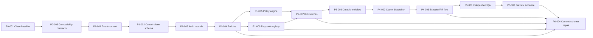

# Dependency Graph

The critical path to the first complete execution slice is:

## Dependency rules

- A dependency is satisfied only when its packet is `verified` or `done` with durable evidence.
- Schema and policy dependencies precede runtime implementation.
- Audit and kill-switch controls precede autonomous execution.
- Codex execution precedes independent QA integration; independent QA precedes the first vertical slice.
- Phase labels describe product sequencing, but branches may proceed in parallel only when their packet dependencies are satisfied.
- Payment, authentication, authorization, RLS, workflow correctness, rollback, and autonomy work always retain Sol escalation.

No cycle exists in the generated graph. Phase 6 content-schema repair intentionally depends on Phase 1, Phase 4, and Phase 5 foundations rather than the broader SEO ingestion path.
