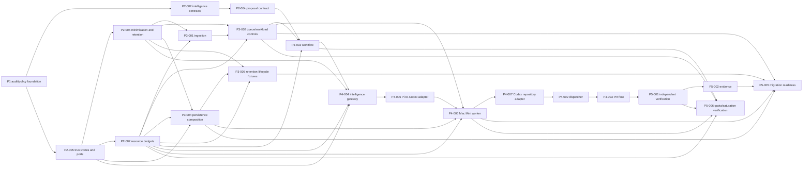

# Dependency Graph

## Dependency rules

- Dependencies are satisfied only at `verified` or `done` with durable evidence.
- `P2-005`, `P2-006`, and `P2-007` are Phase 3 prerequisites; runtime work may
  not invent trust, retention, or quota authorities.
- All infrastructure behavior enters core through stable ports; adapters own
  provider SDKs/configuration. Provider replacement must not rewrite core.
- Ingestion is aggregate-oriented, bounded, deduplicated, idempotent, and
  backpressured. Non-available capacity fails closed to pause/requeue/DLQ.
- Staff/AI exposure is authenticated; cross-account traffic uses audience-bound
  short-lived HTTPS credentials, recipient expiry/audience checks,
  timestamp/nonce replay rejection, idempotency, bounded bodies/timeouts, and
  per-caller/per-route rate limits. Guest booking paths have distinct
  credentials, quotas, deployments, and failure boundaries.
- Missing, unavailable, stale, inconsistent, uncertain, or unknown metering
  fails closed; it may not be estimated into a booking-impacting decision.
- `P5-005`/`P5-006` are evidence gates, not deployment or migration authority.

The graph is acyclic. See `IMPLEMENTATION_BACKLOG.md` for direct dependencies.
