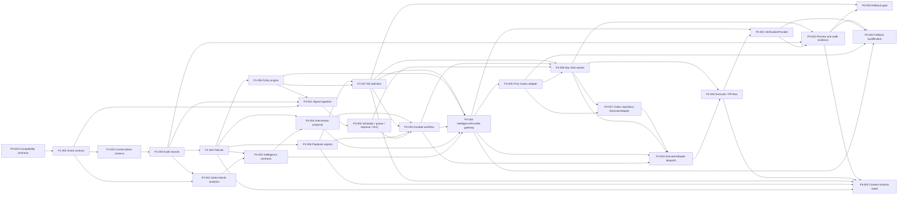

# Dependency Graph

The critical path to the first complete execution slice remains rooted in the
Phase 1 controls, but Phase 2–5 now separates intelligence, proposals,
orchestration, provider invocation, worker execution, and independent
verification:

## Recalculated Phase 2–5 dependencies

| Task | Direct dependencies |
| --- | --- |
| `P2-002` | `P2-001`, `P1-004` |
| `P2-004` | `P2-002`, `P1-004` |
| `P2-003` | `P2-001`, `P2-002`, `P2-004`, `P1-008` |
| `P3-002` | `P3-001` |
| `P3-003` | `P3-002`, `P1-006`, `P1-007`, `P2-004` |
| `P4-004` | `P2-002`, `P2-004`, `P3-003`, `P1-005`, `P1-007` |
| `P4-005` | `P4-004` |
| `P4-006` | `P3-002`, `P3-003`, `P4-005`, `P1-007` |
| `P4-007` | `P4-005`, `P4-006` |
| `P4-002` | `P3-003`, `P4-001`, `P4-004`, `P4-006`, `P4-007`, `GOV-003`, `GOV-004` |
| `P4-003` | `P4-002`, `P4-001`, `P4-006`, `GOV-005` |
| `P5-001` | `P4-003`, `P4-004` |
| `P5-002` | `P5-001`, `P1-003`, `P4-006` |
| `P5-003` | `P5-002`, `P1-007` |
| `P5-004` | `P4-004`, `P4-005`, `P5-001`, `P5-002` |

## Dependency rules

- A dependency is satisfied only when its packet is `verified` or `done` with
  durable evidence.
- Schema and policy dependencies precede runtime implementation.
- Audit, deterministic policy, and kill-switch controls precede provider or
  executor activation.
- Structured intelligence precedes intervention proposals; proposals precede
  durable provider invocation.
- The Pi workflow and queue logically own scheduling, waits, retries,
  dead-lettering, cancellation, and recovery. Initially they run locally on the
  same Mac Mini host as the worker, but their durable state survives Pi-service,
  worker-process, and device restarts and is never Codex ephemeral state.
- The provider-neutral gateway precedes the Codex subscription adapter; the
  adapter precedes the supervised Mac Mini worker and the distinct Codex
  repository ExecutorAdapter.
- Provider-neutral execution precedes independent verification; verification
  precedes the first vertical slice.
- Fallback qualification does not enable a fallback. Configuration, data-policy
  eligibility, and independent approval remain separate requirements.
- Phase labels describe product sequencing, but branches may proceed in parallel
  only when their packet dependencies are satisfied.
- Payment, authentication, authorization, RLS, workflow correctness,
  concurrency, rollback, and autonomy work always retain Sol escalation.

The recalculated Phase 2–5 graph is acyclic. `P6-004` receives the new gateway,
adapter, worker, repository ExecutorAdapter, and independent-verification
controls transitively through `P4-003` and `P5-002`; its existing direct
dependencies do not need to be
rewritten by this governance task.
